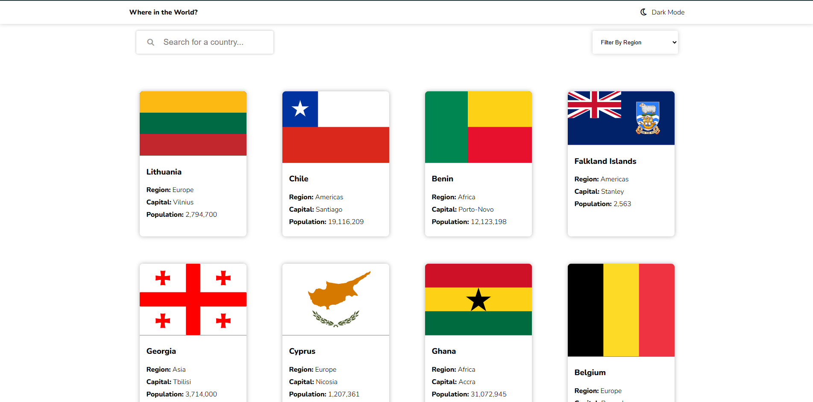
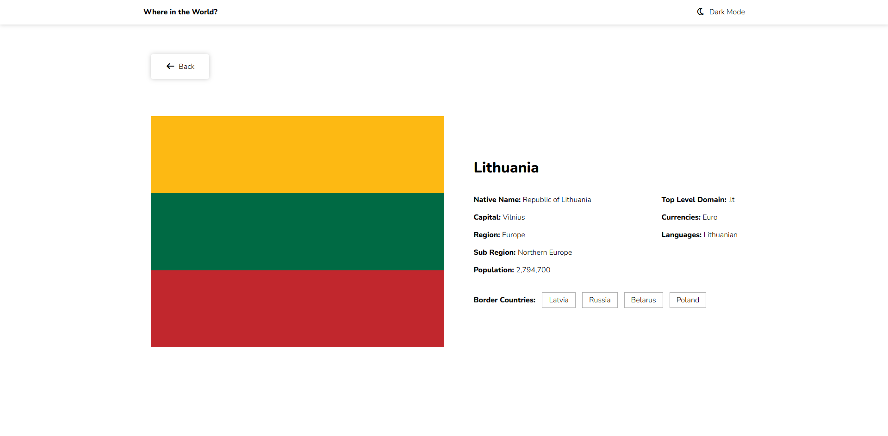
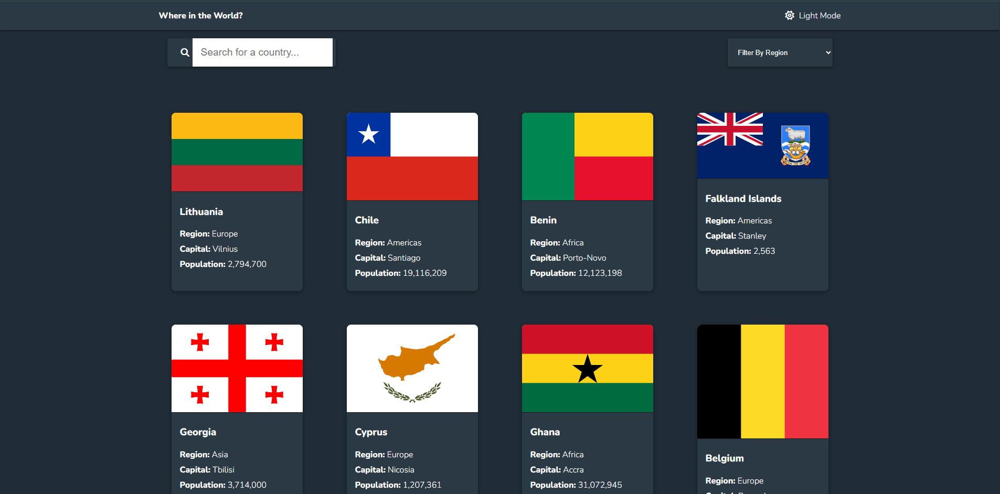

# 🌍 Where in the World?

A **Country Explorer Web App** built with **HTML, CSS, and JavaScript** that allows users to search for countries, filter them by region, view detailed information, and toggle between **Dark/Light Mode**.  
The app fetches live data from the **[REST Countries API](https://restcountries.com/)**.

---

## 🚀 Live Demo
🔗 [Live Preview](https://sudhanshuverse.github.io/js-interactive-projects/02-where-in-the-world)  

---

## 📸 Screenshots

### 🏠 Home Page
Search and filter countries with real-time suggestions.  


### 📖 Country Detail Page
View detailed information including borders, languages, population, and currencies.  


### 🌙 Dark Mode
Toggle between **Light Mode** and **Dark Mode** seamlessly.  


(*Make sure to add screenshots inside a `screenshots/` folder and update paths accordingly.*)

---

## ✨ Features

- 🔍 **Search Countries** by name with autocomplete suggestions.
- 🌎 **Filter by Region** (Africa, Asia, Europe, Americas, Oceania).
- 📑 **Detailed Country Page** with:
  - Flag  
  - Capital  
  - Population  
  - Region & Subregion  
  - Native Name  
  - Top-Level Domain  
  - Currencies  
  - Languages  
  - Border Countries (linked to their details)  
- 💡 **Dark/Light Mode Toggle** with smooth UI.
- 🎨 **Shimmer Loading Effect** for better UX.
- 📱 **Responsive Design** for all devices.

---

## 🛠️ Tech Stack

- **HTML5** – Structure  
- **CSS3** – Styling & Responsive Layout  
- **JavaScript (ES6+)** – Functionality  
- **REST Countries API v3.1** – Country Data  
- **Google Fonts (Nunito)** – Typography  
- **Font Awesome** – Icons  

---

## 📂 Project Structure
```js
where-in-the-world/
│── index.html # Main page with search & filter
│── country.html # Country details page
│── style.css # App styles
│── script.js # Home page logic
│── country.js # Country details page logic
│── /screenshots # Screenshots for README
│── README.md # Project documentation
```

---

## ⚙️ Installation & Setup

1. **Clone the repository**
   ```bash
   git clone https://github.com/sudhaanshuverse/where-in-the-world.git
Navigate into the project folder

## 👨‍💻 Author
Sudhanshu Kumar

## ⭐ Contributing
Contributions are welcome!
If you'd like to improve the project, please fork the repo and submit a pull request.

